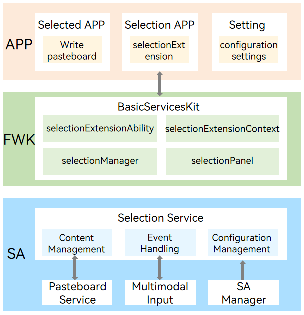

# selectionfwk

## Introduction
This repository primarily stores the source code information of the Selection Service Subsystem, which has the capability to globally capture user-selected text and manage selection applications.

### Content Introduction
Developers can easily achieve word extension capabilities on existing applications by calling the interfaces provided by this subsystem. This extension capability supports capturing user selected text content on a global scale. Developers can implement their own business logic based on captured text content, such as text translation, content summarization, intelligent expansion, etc. At the same time, the word drawing service subsystem provides comprehensive panel management capabilities, supporting developers to create, display, move, hide, and destroy panels. Developers can customize the UI style and interaction logic of the panel, flexibly present translation results, summary information, and other content, ultimately achieving a smooth experience of "selecting text ->popping up the smart panel".

### Architectural Diagram



As shown in the above figure, the selection service mainly includes three modules: selection content management, selection event processing, and selection configuration management. Among them, the selection content management module mainly verifies the selection content received by the selection service from the clipboard service to ensure that it is text content. At the same time, it will filter out the blank characters and pass them to the selection application. The selection event processing module is mainly responsible for processing keyboard and mouse events transmitted by the multimodal input module, driving the internal state machine of the selection service through events to recognize user double clicks, triple clicks, and single click sliding operations. The selection configuration management module is mainly responsible for managing the configuration items of selection services, such as selection triggering methods, selection application switching, selection service switches, etc. These configuration items can be bound to users and persistent. For a detailed introduction to selection services and other modules, please refer to [Overview of selection service](https://gitcode.com/openharmony/docs/blob/master/zh-cn/application-dev/basic-services/selectionInput/selection-services-intro.md).

## Directory Structure

```
/foundation/systemabilitymgr
├── selectionfwk
│   ├── common                                      # Common code 
│   ├── etc                                         # Configuration files for component processes
│   ├── figures                                     # Framework diagram
│   ├── frameworks                                  # Interface implementations
│   │   ├── js/napi                                 # Selection framework NAPI interfaces
│   │   └── native                                  # Native interfaces
│   ├── hiappevent_agent                            # hiappevent platform logging
│   ├── interfaces                                  # IDL interface definition files
│   ├── sa_profile                                  # SA definitions
│   ├── services                                    # Selection framework services
│   ├── sysevent                                    # hisysevent platform logging
│   ├── test                                        # Test directory
│   │   ├── fuzztest                                # Fuzz testing
│   │   └── unitest                                 # Unit tests for interfaces
│   ├── utils                                       # Core service utility code
```

### Constraints and Restrictions

- The [PC/2-in-1](https://gitcode.com/openharmony/docs/blob/master/en/application-dev/quick-start/module-configuration-file.md#deviceTypes) device supports external keyboards and mice.

- Support for retrieving text selections, with a maximum length of 6,000 bytes.

- Supports use on extended screens, does not support cross device use.

- For applications that do not support copying or can only be copied and pasted within the current application, the word marking function will become invalid. Therefore, it is recommended that developers configure corresponding blacklists or whitelists when developing word drawing applications.


## Build Steps

- Full Build

    After modifying the build.gn file, execute:
    ```
    $ ./build.sh --product-name rk3568 --ccache
    ```
    If the build.gn file is unmodified, execute:
    ```
    $ ./build.sh --product-name rk3568 --ccache --fast-rebuild
    ```

- Partial Build

    ```
    $ ./build.sh --product-name rk3568 --ccache --build-target selectionfwk
    ```


## Instructions

### Interface Description

Selection service provides [selectionExtensionAbility](https://gitcode.com/openharmony/docs/blob/master/zh-cn/application-dev/reference/apis-basic-services-kit/js-apis-selectionInput-selectionExtensionAbility.md)、[selectionExtensionContext](https://gitcode.com/openharmony/docs/blob/master/zh-cn/application-dev/reference/apis-basic-services-kit/js-apis-selectionInput-selectionExtensionContext.md)、[selectionManager](https://gitcode.com/openharmony/docs/blob/master/zh-cn/application-dev/reference/apis-basic-services-kit/js-apis-selectionInput-selectionManager.md)、[selectionPanel](https://gitcode.com/openharmony/docs/blob/master/zh-cn/application-dev/reference/apis-basic-services-kit/js-apis-selectionInput-selectionPanel.md).The interfaces of the four modules are available for developers to use. Among them, the selectionExtendeAbility module is responsible for managing the selectionextension; The selectionExtendeContext module is responsible for managing the context of selectionextension; The selectionManager module is the core module provided by the selection service, responsible for monitoring selection completion events, obtaining selection content, managing selection panels, etc; The selectionPanel module provides properties and information for the word panel. The commonly used interfaces in the selectionManager module are shown in the following table:

| name | description |
| ---- | ---- |
| on(type: 'selectionCompleted', callback: Callback\<SelectionInfo\>): void | Subscription completion event, use the callback function. |
| getSelectionContent(): Promise\<string\> | Retrieve the content of the selected text. |
| createPanel(ctx: Context, info: PanelInfo): Promise\<Panel\> | Create selection panel. |
| show(): Promise\<void\> | Shwo panel. |
| hide(): Promise\<void\> | Hide panel |
| startMoving(): Promise\<void\> | Enable the current panel to be dragged with the mouse. |
| moveTo(x: number, y: number): Promise\<void\> | Move the panel to the designated position on the screen. |

### Instructions for Use

Please refer to the specific usage method[Implement a selection extensionability](https://gitcode.com/openharmony/docs/blob/master/zh-cn/application-dev/basic-services/selectionInput/selection-services-application-guide.md)。


## Related code repository

[Selection Service](https://gitcode.com/openharmony-sig/systemabilitymgr_selectionfwk)