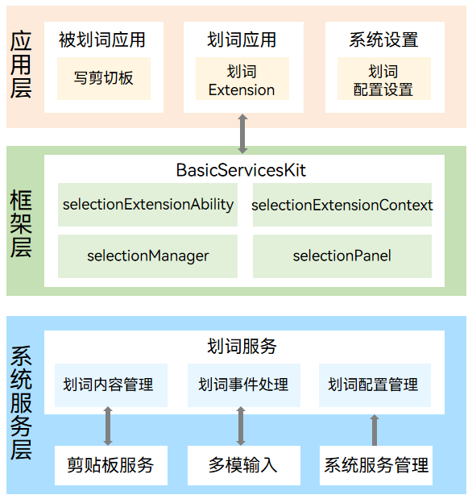

# 划词服务子系统

## 简介

该仓主要存放划词服务子系统的源码信息。划词服务子系统具有全局获取用户选中文本及管理划词应用的能力。

### 内容介绍

开发者可通过调用该子系统提供的接口，在现有应用的基础上，轻松实现划词扩展能力。该扩展能力支持在全局范围内捕获用户选中的文本内容。开发者可基于捕获到的文本内容实现自己的业务逻辑，如文本翻译、内容摘要、智能扩写等。同时，划词服务子系统提供了完善的面板管理能力，支持开发者创建、显示、移动、隐藏、销毁面板。开发者可自定义面板的UI样式与交互逻辑，灵活呈现翻译结果、摘要信息等内容，最终实现“选中文本—>弹出智能面板”的流畅体验。

### 框架图



如上图所示，划词服务主要包含划词内容管理、划词事件处理、划词配置管理三个模块：

- 划词内容管理模块：主要负责校验剪贴板服务传递的用户划词内容，确保其为纯文本且不为空，并过滤掉划词内容中的空白字符，然后传递给划词应用。

- 划词事件处理模块：主要负责处理多模输入模块传递的键鼠事件，通过事件驱动划词服务内部的状态机，以识别用户的双击、三击和单击滑动操作。

- 划词配置管理模块：主要负责管理划词服务的配置项，如划词触发方式、划词应用切换和划词服务开关等。所有的配置项均支持用户级绑定与持久化存储。

有关划词服务的详细业务流程介绍可参见[划词服务概述](https://gitcode.com/openharmony/docs/blob/master/zh-cn/application-dev/basic-services/selectionInput/selection-services-intro.md)。


## 目录

```
/foundation/systemabilitymgr
├── selectionfwk
│   ├── common                                      # 公共代码
│   ├── etc                                         # 组件包含的进程的配置文件
│   ├── figures                                     # 框架原理图
│   ├── frameworks                                  # 接口实现
│   │   ├── js/napi                                 # 划词框架napi接口
│   │   └── native                                  # native接口
│   ├── hiappevent_agent                            # hiappevent平台打点
│   ├── interfaces                                  # idl接口定义文件
│   ├── sa_profile                                  # sa定义
│   ├── services                                    # 划词框架服务
│   ├── sysevent                                    # hisysevent平台打点
│   ├── test                                        # 接口测试目录
│   │   ├── fuzztest                                # fuzz测试
│   │   └── unitest                                 # 接口的单元测试
│   ├── utils                                       # 核心服务工具代码目录
```

## 约束

- 支持外接键盘和鼠标的[PC/2in1](https://gitcode.com/openharmony/docs/blob/master/zh-cn/application-dev/quick-start/module-configuration-file.md#devicetypes标签)设备。

- 支持获取文本类型的划词内容，最大长度限制为6000个字节。

- 支持在扩展屏上使用，不支持跨设备使用。

- 对于不支持复制或只能在当前应用内复制粘贴的被划词应用，划词功能会失效。因此，建议开发者在开发划词应用时配置相应的黑名单或白名单。


## 编译构建

- 全量编译

    修改build.gn文件后编译命令
    ```
    $ ./build.sh --product-name rk3568 --ccache
    ```
    未修改build.gn文件编译命令
    ```
    $ ./build.sh --product-name rk3568 --ccache --fast-rebuild
    ```

- 单独编译

    ```
    $ ./build.sh --product-name rk3568 --ccache --build-target selectionfwk
    ```


## 说明

### 接口说明

划词服务提供了[selectionExtensionAbility](https://gitcode.com/openharmony/docs/blob/master/zh-cn/application-dev/reference/apis-basic-services-kit/js-apis-selectionInput-selectionExtensionAbility.md)、[selectionExtensionContext](https://gitcode.com/openharmony/docs/blob/master/zh-cn/application-dev/reference/apis-basic-services-kit/js-apis-selectionInput-selectionExtensionContext.md)、[selectionManager](https://gitcode.com/openharmony/docs/blob/master/zh-cn/application-dev/reference/apis-basic-services-kit/js-apis-selectionInput-selectionManager.md)、[selectionPanel](https://gitcode.com/openharmony/docs/blob/master/zh-cn/application-dev/reference/apis-basic-services-kit/js-apis-selectionInput-selectionPanel.md)四个模块的接口供开发者使用。其中，selectionExtensionAbility模块负责划词扩展的声明周期管理；selectionExtensionContext模块负责划词扩展的上下文管理；selectionManager模块是划词服务提供的核心模块，负责监听划词完成事件、获取划词内容、管理划词面板等；selectionPanel模块提供了划词面板的属性和信息。selectionManager模块中的常用接口如下表所示：

| 名称 | 描述 |
| ---- | ---- |
| on(type: 'selectionCompleted', callback: Callback\<SelectionInfo\>): void | 订阅划词完成事件，使用`callback`回调函数。 |
| getSelectionContent(): Promise\<string\> | 获取选中文本的内容。 |
| createPanel(ctx: Context, info: PanelInfo): Promise\<Panel\> | 创建划词面板。 |
| show(): Promise\<void\> | 显示面板。 |
| hide(): Promise\<void\> | 隐藏面板。 |
| startMoving(): Promise\<void\> | 使当前划词面板可以随鼠标拖动。 |
| moveTo(x: number, y: number): Promise\<void\> | 移动划词面板至屏幕指定位置。 |

### 使用说明

具体使用方法请参考[实现一个划词扩展能力](https://gitcode.com/openharmony/docs/blob/master/zh-cn/application-dev/basic-services/selectionInput/selection-services-application-guide.md)。


## 相关仓

[划词服务](https://gitcode.com/openharmony-sig/systemabilitymgr_selectionfwk)
